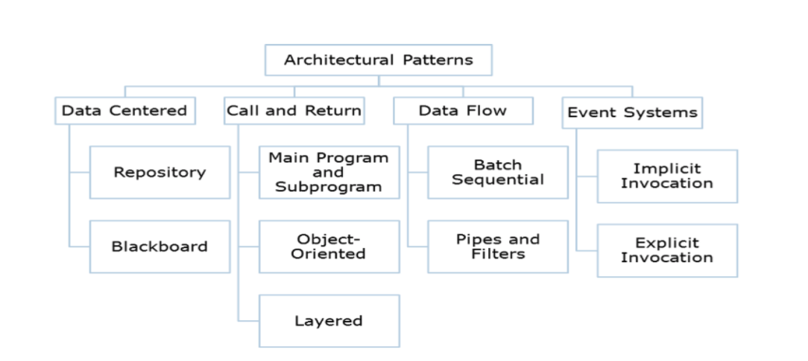

#Software Engineering (CSC 510)

__Agile__ is an improvement over waterfall. Continuous integration, test first programming, etc.

- Individuals and interactions
- Working software
- Customer collaboration
- Responding to change

###Design:
- __UML__ (Unified Modeling Language) 
- __Wireframe__ is a view schematic that captures all layout and content decisions of that view (*Balsamiq*).
- __Storyboard__ illustrates the timeline of user performing a task as a sequence of frames.

#####Design process:

- Idea Generation. What is the problem? What is the user trying to do? 
- Screening. Why is this a problem? What are competitors doing?
- Design Specification. What patterns can we use? What is core product concept (sketches)?
- Feasibility. What would be first step? What are core technologies to leverage?
- Feedback. What does users say?  What do peers say?

###Architectural Design 
#####Goals:

- Skeleton of system, repositories for designs (Templates for programmers to build systems).
- Concepts and constraints (Provide framework for how components interact).
- Stakeholder communication (Abstract enough to explain to non-experts).

#####System Requirements Affect Architecture:

- Performance
- Security
- Safety
- Availability / Replicability
- Maintainability

#####An architectural pattern consists of:

- a set of component types (e.g. process, procedure) that perform some function at runtime.
- a topological layout of the components showing their runtime relationships.
- a set of connectors (e.g. data streams, sockets) that mediate communication among components.

####Data Centered Patterns:
When a system can be described as a centralized data store that communicates with a number of clients.

- (+) Easy to administer.
- (–) Hard to track down errors/dependencies.

#####Repository Model (pull)
Components must exchange information so they can work together effectively. 
Data held in central database that is accessible by all components.

- Components write data in the repository
- Components read data from the repository
- (+) Easy to implement as a whole
- (–) Clients may become complex when polling

#####Blackboard Model (push)
Three components: Knowledge sources, Blackboard, Control component. 

- Components register data subscription
- Components are notified when data is available
– (-) Infrastructure complex
- (+) Client programming is simplified

####Call and Return Patterns
Typical control flow imposed by modern programming languages.

- (+) Easy to reason about behavior from static code
- (–) Sometimes not flexible enough

#####Main and Subprogram
- (+) Easy to program
- (+) Easy to understand
- (–) Performance can suffer without multiple threads
- (–) Can be hard to extend

#####Object-Oriented
- (+) Well defined interfaces
- (–) Interface changes break all users of a particular class
- (–) Multiple threads may contend for access to object data

#####Layered Model
- (+) Easy to extend system by inserting new layer which provides same interface
- (–) Structuring layers can be difficult as layers may require services of non-adjacent layers
- (–) Performance can suffer since requests must pass through many layers

####Data Flow Pattern
Architectural pattern for stream processing. 
Every component defines a processing/computational step. 
Data flows through components and connections.

- (+) Supports easy reuse of components
- (+) Fairly easy to reason about (composition)
- (+) Easy to maintain by adding components
- (–) Some component may have to wait for the output of the previous pipe to finish
- (–) Sometimes difficult to maintain correspondences between separate streams

#####Pipe-And-Filter
- Components (Filters)
	- Set of inputs and outputs
	- Local transformation
- Connectors (Pipes)
	- Facilitate data flow
- Constraints
	- Do not share state
	- Have no knowledge of other filters

#####Batch Sequential
Each component completes transformation of input before passing to output. 
A degenerate case of pipe-and-filter where no streaming occurs.

####Event System
Execution is controlled by events; a packet coming in, a button being clicked, etc…

__Design Pattern(TBA)__
